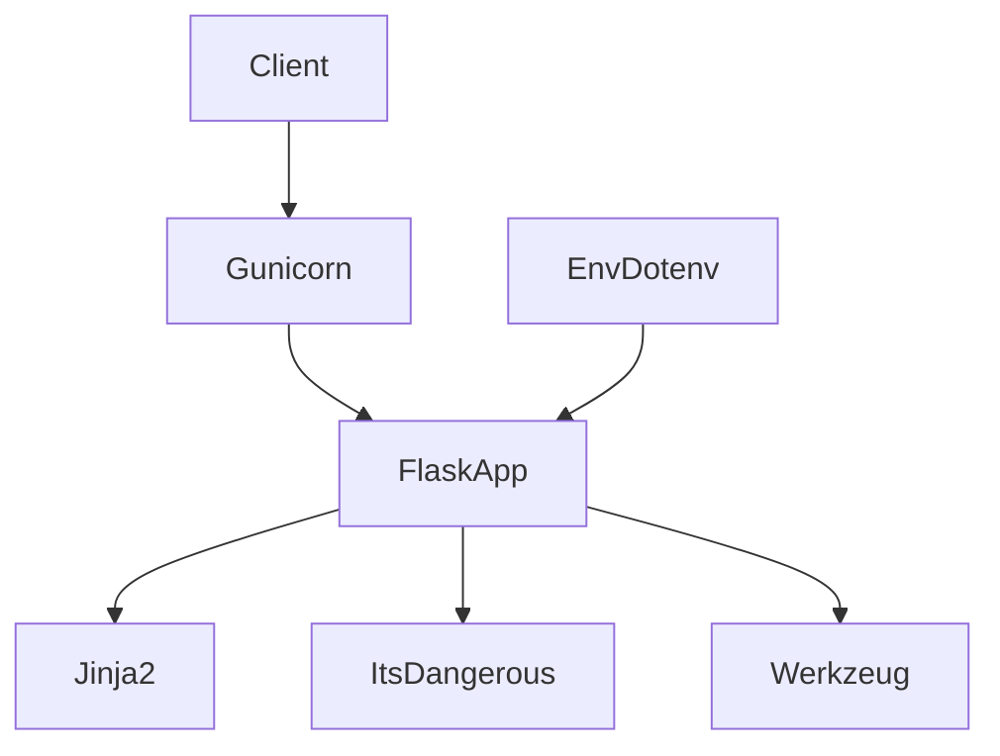

# Starter Flask API
Minimal, production-ready Flask REST API scaffold with a root endpoint and clear deployment options.

## Quick Start
```bash
# 1) Create and activate a virtual environment
python3 -m venv venv
# macOS/Linux
source venv/bin/activate
# Windows
venv\Scripts\activate

# 2) Install dependencies
pip install -r requirements.txt

# 3) Run (production-grade)
gunicorn app:app -w 4 -b 0.0.0.0:8000

# Optional: dev server (not recommended for production)
# python app.py
```

## Architecture


## Tech Stack
- Python
- Flask
- Gunicorn
- Uvicorn
- Waitress
- Jinja2
- ItsDangerous
- Werkzeug
- python-dotenv

## Key Features
- Minimal Flask application with a root route
- Production-ready deployment options with Gunicorn, Uvicorn, and Waitress
- Lightweight skeleton with clear entry points (app.py, server.py) for rapid REST API development